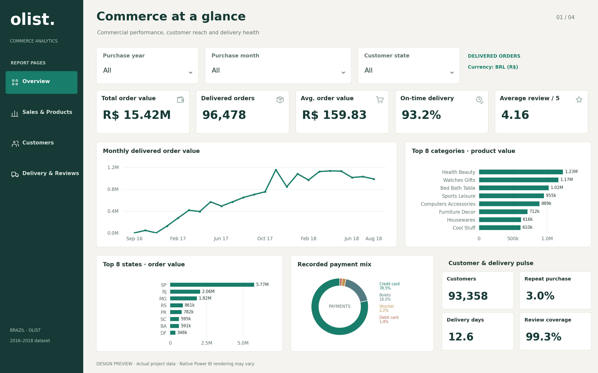

# Olist Commerce Insights

I built this project to understand how an e-commerce business performs beyond its sales totals. Using Olist's Brazilian e-commerce dataset, I looked at what customers buy, whether they return, and how delivery delays relate to their reviews.

The project brings together Python, MySQL and Power BI. I used Python to prepare and analyse the data, SQL to answer business questions, and Power BI to present the results across four report pages. I also included a browser dashboard so the data can be explored without installing Power BI Desktop.

## Live dashboard

[Explore the interactive browser dashboard](https://rushabkarania.github.io/Olist-Commerce-Insights/)



## What I looked at

- **Overview:** order value, order volume and overall performance.
- **Sales & Products:** category performance, freight costs and payment methods.
- **Customers:** customer locations and repeat purchases.
- **Delivery & Reviews:** delivery times, late orders and customer satisfaction.

Year, month and state filters let you explore the same selection across the report pages.

## Main findings

For delivered orders, the prepared dataset contains **96,478 orders**, **93,358 unique customers** and approximately **R$15.42 million in order value**, including products and freight.

A few findings stood out:

- On-time or early deliveries received an average review of **4.29/5**, compared with **2.27/5** for late deliveries.
- **2,801 customers**, about **3%**, placed more than one delivered order during the period covered.
- São Paulo contributed approximately **R$5.77 million** in order value.
- Health Beauty was the leading category by product value, at approximately **R$1.23 million**.

The delivery results suggest delays are worth investigating, but they do not prove that delays alone caused lower reviews. Order value also does not represent profit. The data covers 2016–2018, with incomplete periods at the beginning and end.

## Metric definitions

Order value includes products and freight for delivered orders. Average order value divides that amount by delivered orders. Repeat customers have at least two delivered orders in the current selection. On-time delivery includes orders delivered on or before the estimated calendar date; orders with missing delivery dates are excluded. Review averages use one prepared score per order and exclude unreviewed orders.

## How the project works

I checked missing values, duplicates, timestamps and payment records before preparing the analysis tables. Orders can have several items or payment records, so I kept those tables separate to avoid counting the same values more than once.

The SQL analysis covers monthly trends, category rankings, repeat purchases and delivery performance. The statistical notebook uses Mann–Whitney U, chi-square and Spearman tests to examine delivery and review patterns.

## Open the Power BI report

Open [Olist_Commerce_Analytics.pbix](powerbi/Olist_Commerce_Analytics.pbix) in Power BI Desktop.

The editable [Power BI project](powerbi/Olist_Commerce_Analytics.pbip) is also included. Keep its report and semantic model folders together, then select **Home → Refresh** after opening it. The prepared snapshot is embedded, so MySQL is not needed to view the report.

## Run the browser dashboard

From the project folder, with Python and Node.js 22+ installed:

```bash
python scripts/build_site.py
node tests/analytics.test.mjs
python -m http.server 8000 --directory dist
```

Open `http://localhost:8000`. The browser dashboard uses JavaScript and the same prepared data; it is a separate version of the report. To publish on GitHub Pages, choose **Settings → Pages → Source → GitHub Actions** in the repository, then run the included workflow from the Actions tab.

## Files in this repository

| Folder | Contents |
|---|---|
| `notebooks/` | Data inspection, cleaning and statistical analysis |
| `sql/` | Schema, data loading, quality checks and business queries |
| `powerbi/` | Report files, model, prepared data and design assets |
| `web/` | Interactive browser dashboard |
| `reports/` | Charts and analysis results |
| `scripts/` and `tests/` | Build scripts and checks for dashboard calculations |
| `assets/` | Dashboard preview |

To repeat the analysis, download the original dataset into `data/raw/`, install `requirements.txt`, and run the notebooks in numbered order. SQL setup instructions are included in `sql/02_load_data.sql`.

## Data source and licence

The data comes from the [Brazilian E-Commerce Public Dataset by Olist](https://www.kaggle.com/datasets/olistbr/brazilian-ecommerce), licensed under **CC BY-NC-SA 4.0**. Those terms also apply to the derived data and report content. Original code and interface assets use the MIT licence. Both sets of terms are included in [LICENSE](LICENSE).

**Rushab Karania**
